# 노션 → ai-folio 블로그 변환 도구 ⚡

**간단하고 확실한** 노션을 ai-folio 블로그로 변환하는 도구입니다.

## 🎯 특징

- ✅ **단순함**: 복잡한 설정 없이 바로 사용
- ✅ **안정성**: 검증된 방법으로 확실한 변환
- ✅ **완전 자동**: 이미지, 태그, front matter 모두 자동 처리
- ✅ **ai-folio 최적화**: Jekyll과 완벽 호환
- 🆕 **DB 자동화**: 노션 URL만으로 완전 자동 변환

## 📁 파일 구조

```
scripts/
├── 📄 notion_db_auto.py     # 🌟 노션 DB URL 자동 변환 (NEW!)
├── 📄 notion_to_blog.py     # 📄 Export 파일 변환
├── 📄 markdown_utils.py     # 마크다운 처리 함수들
├── 📄 markdown_improver.py  # 기존 마크다운 개선 도구
├── 📄 setup_guide.md        # 빠른 시작 가이드
└── 📄 README.md             # 이 파일
```

## 🚀 사용법

### 🥇 **방법 1: 노션 DB URL 완전 자동화** ⭐ **추천**

```bash
# 1. 노션 API 토큰 설정 (한 번만)
export NOTION_TOKEN="your_integration_token"

# 2. 노션 DB URL만으로 완전 자동 변환!
python3 scripts/notion_db_auto.py \
  --database-url "https://unknown-nlp-study.notion.site/24dbac48c8d34705ba7d2ac1317274ec"
```

**장점:**

- 🎯 **URL만 있으면 끝**: 수동 작업 없음
- ⚡ **실시간 동기화**: 노션 업데이트 시 재실행만 하면 됨
- 🔄 **배치 처리**: 모든 논문을 한 번에 처리
- 🖼️ **이미지 지원**: API를 통한 이미지 다운로드

### 🥈 **방법 2: Export 파일 변환**

```bash
# 1. 노션에서 "Export" → "Markdown & CSV"로 내보내기
# 2. 파일 변환
python3 scripts/notion_to_blog.py --notion-file "논문제목.md" --date "2025-01-02"

# 3. 여러 파일 일괄 변환
python3 scripts/notion_to_blog.py --notion-dir "notion_exports/" --batch
```

**장점:**

- 🔒 **API 토큰 불필요**: 간단한 설정
- 📷 **이미지 확실**: Export된 이미지 직접 복사
- 🎨 **커스터마이즈**: 세부 조정 가능

## 📊 변환 과정

### 방법 1: DB 자동화

```mermaid
graph LR
    A[노션 DB URL] --> B[API 호출]
    B --> C[페이지 리스트]
    C --> D[내용 변환]
    D --> E[ai-folio 포스트]
```



### 방법 2: Export 변환

```mermaid
graph LR
    A[노션 Export] --> B[스크립트 실행]
    B --> C[메타데이터 추출]
    C --> D[이미지 복사]
    D --> E[ai-folio 포스트]
```



## 🔧 설정

### 노션 API 토큰 생성 (방법 1용)

1. [Notion Developers](https://developers.notion.com/) 방문
2. "New integration" 클릭
3. 토큰 복사 후 환경변수 설정:
   ```bash
   export NOTION_TOKEN="secret_ABC123..."
   ```
4. 노션 데이터베이스에서 Integration 연결:
   - 데이터베이스 페이지 → "..." → "Add connections" → Integration 선택

## 💡 사용 예시

### 🆕 **DB 자동화 예시**

```bash
# 전체 논문 DB 동기화
python3 scripts/notion_db_auto.py \
  --database-url "https://notion.so/your-database-url" \
  --start-date "2025-01-01"

# 특정 날짜부터
python3 scripts/notion_db_auto.py \
  --database-url "https://notion.so/your-database-url" \
  --start-date "2024-01-01"

# 토큰을 파라미터로 전달
python3 scripts/notion_db_auto.py \
  --database-url "https://notion.so/..." \
  --token "secret_ABC123..."
```

### 📄 **Export 변환 예시**

```bash
# 단일 파일
python3 scripts/notion_to_blog.py --notion-file "paper.md" --date "2025-01-02"

# 커스텀 제목
python3 scripts/notion_to_blog.py \
  --notion-file "paper.md" \
  --title "내가 정한 제목" \
  --date "2025-01-02"
```

## 📈 성능 비교

| 특징              | DB 자동화        | Export 변환  |
| ----------------- | ---------------- | ------------ |
| **설정 복잡도**   | 보통 (토큰 필요) | 간단         |
| **속도**          | 빠름             | 매우 빠름    |
| **자동화**        | 완전 자동 ⭐     | 수동 export  |
| **이미지 처리**   | API 다운로드     | 직접 복사 ⭐ |
| **실시간 동기화** | 가능 ⭐          | 불가능       |
| **안정성**        | 높음             | 매우 높음 ⭐ |

## 🛠️ 고급 기능

### 🔄 **정기 동기화**

```bash
#!/bin/bash
# auto_sync.sh

echo "🔄 주간 논문 동기화 시작..."

python3 scripts/notion_db_auto.py \
  --database-url "https://notion.so/your-database" \
  --start-date "$(date -d '7 days ago' +%Y-%m-%d)"

# Jekyll 재시작
pkill -f jekyll
bundle exec jekyll serve --detach

echo "✅ 동기화 완료!"
```

### ⏰ **Cron 자동화**

```bash
# 매주 일요일 오전 9시에 실행
0 9 * * 0 /path/to/auto_sync.sh
```

### 🎨 **기존 마크다운 개선**

```bash
python3 scripts/markdown_improver.py --input "기존파일.md"
```

## 🔧 문제 해결

### DB 자동화 관련

**Q: "Unauthorized" 오류**

- 노션 API 토큰 확인
- Integration이 데이터베이스에 연결되어 있는지 확인

**Q: 이미지가 다운로드되지 않음**

- 현재 버전에서는 이미지 URL만 참조 (향후 업데이트 예정)
- Export 방식 사용 권장

**Q: 변환 속도가 느림**

- API 제한으로 인한 지연 (정상)
- 대량 변환 시 시간 소요 예상

### Export 변환 관련

**Q: 이미지가 표시되지 않음**

```bash
# 이미지 파일 확인
ls -la assets/img/posts/2025-01-02-제목/

# Jekyll 서버 재시작
bundle exec jekyll serve
```

**Q: 한글 인코딩 문제**

- 노션 export 시 UTF-8 확인
- 파일명에 특수문자 피하기

## 📦 필요한 패키지

### DB 자동화용

```bash
pip install notion-client PyYAML
```

### Export 변환용

```bash
pip install PyYAML  # 기본 라이브러리만
```

## 🎖️ 권장 워크플로

### 🥇 **추천: 하이브리드 접근**

1. **초기 설정**: DB 자동화로 전체 논문 가져오기
2. **이미지 보완**: 중요한 논문은 Export 방식으로 재변환
3. **정기 동기화**: 새 논문은 DB 자동화로 추가
4. **세부 조정**: markdown_improver로 개별 개선

## 📚 참고 자료

- **Jekyll 문서**: https://jekyllrb.com/docs/
- **ai-folio 테마**: https://github.com/alshedivat/al-folio
- **노션 API**: https://developers.notion.com/
- **마크다운 가이드**: https://www.markdownguide.org/

## 🙋‍♂️ 지원

문제가 발생하면:

1. `setup_guide.md` 확인
2. 적절한 방법 선택 (DB 자동화 vs Export)
3. 에러 로그와 함께 문의
4. 코드 직접 수정도 환영! 🎉

---

**Made with ❤️ for efficient academic blogging**
