# 노션 → ai-folio 블로그 변환 도구 ⚡

**간단하고 확실한** 노션 export를 ai-folio 블로그로 변환하는 도구입니다.

## 🎯 특징

- ✅ **단순함**: 복잡한 설정 없이 바로 사용
- ✅ **안정성**: 검증된 방법으로 확실한 변환  
- ✅ **완전 자동**: 이미지, 태그, front matter 모두 자동 처리
- ✅ **ai-folio 최적화**: Jekyll과 완벽 호환

## 📁 파일 구조

```
scripts/
├── 📄 notion_to_blog.py     # 🌟 메인 변환 스크립트
├── 📄 markdown_utils.py     # 마크다운 처리 함수들
├── 📄 markdown_improver.py  # 기존 마크다운 개선 도구  
├── 📄 setup_guide.md        # 빠른 시작 가이드
└── 📄 README.md             # 이 파일
```

## 🚀 사용법

### 📋 준비 단계
1. 노션에서 **"Export" → "Markdown & CSV"**로 내보내기
2. 다운로드된 파일을 적당한 폴더에 저장

### 🔄 변환 명령어

#### 단일 파일 변환
```bash
python3 scripts/notion_to_blog.py --notion-file "논문제목.md" --date "2025-01-02"
```

#### 여러 파일 일괄 변환  
```bash
python3 scripts/notion_to_blog.py --notion-dir "notion_exports/" --batch
```

#### 커스텀 설정
```bash
python3 scripts/notion_to_blog.py \
  --notion-file "paper.md" \
  --date "2025-01-02" \
  --title "내가 정한 제목"
```

## 📊 변환 과정

```mermaid
graph LR
    A[노션 Export] --> B[스크립트 실행]
    B --> C[메타데이터 추출]
    C --> D[이미지 복사]
    D --> E[마크다운 개선]
    E --> F[ai-folio 포스트]
```



### 🔍 자동 처리 항목
1. **메타데이터 추출**: Venue, Date, Person, Property
2. **이미지 처리**: 자동 검색, 복사, 경로 변환
3. **태그 생성**: 내용 분석 기반 스마트 태그
4. **Front Matter**: Jekyll 호환 YAML 헤더 생성
5. **가독성 개선**: 리스트, 코드블록, 강조 정리

## 💡 예시

### 입력 (노션 Export)
```
downloads/
├── Attention Is All You Need.md
└── Attention Is All You Need/
    ├── architecture.png
    ├── results.png
    └── comparison.png
```

### 출력 (ai-folio 블로그)
```
_posts/
└── 2025-01-02-attention-is-all-you-need.md

assets/img/posts/
└── 2025-01-02-attention-is-all-you-need/
    ├── architecture.png
    ├── results.png
    └── comparison.png
```

### 생성된 블로그 포스트
```markdown
---
layout: post
title: "Attention Is All You Need"
date: 2025-01-02 00:00:00
description: NIPS 논문 리뷰 - NLP, Transformer 관련 연구
tags: [paper-review, transformer, attention, nlp, nips]
categories: [paper-reviews]
giscus_comments: true
related_posts: false
slug: 2025-01-02-attention-is-all-you-need
---

**논문 정보**
- **Venue**: NIPS 2017
- **Date**: 2017년 6월
- **Reviewer**: 홍길동
- **Property**: NLP, Transformer

## 📝 Abstract
Transformer 아키텍처를 제안...



## 🔍 Key Insights
- Self-attention 메커니즘의 혁신...
- 병렬화 가능한 구조...
```

## 🛠️ 고급 기능

### 기존 마크다운 개선
```bash
python3 scripts/markdown_improver.py --input "기존파일.md"
```

### 배치 처리
```bash
# 모든 notion export를 한번에 변환
find downloads/ -name "*.md" -exec python3 scripts/notion_to_blog.py --notion-file {} --date "2025-01-{}" \;
```

## 🔧 문제 해결

### 자주 발생하는 문제

**Q: 이미지가 표시되지 않아요**
```bash
# 이미지 파일 확인
ls -la assets/img/posts/2025-01-02-제목/

# Jekyll 서버 재시작
bundle exec jekyll serve
```

**Q: 한글 인코딩 문제**
- 노션 export 시 UTF-8 확인
- 파일명에 특수문자 피하기

**Q: 변환 실패**
```bash
# 자세한 로그 확인
python3 scripts/notion_to_blog.py --notion-file "file.md" --date "2025-01-02" 2>&1 | tee log.txt
```

## 📈 성능

- **처리 속도**: 논문 1개당 ~2초
- **지원 형식**: PNG, JPG, JPEG, GIF, WebP
- **파일 크기**: 제한 없음 (GitHub 100MB 제한 적용)
- **동시 처리**: 일괄 변환 지원

## 🎨 커스터마이즈

### 태그 추가
`markdown_utils.py`의 `ai_keywords` 리스트 수정:
```python
ai_keywords = [
    "transformer", "attention", "bert", "gpt", 
    "your-custom-tag"  # 여기에 추가
]
```

### 이미지 형식 변경
`notion_to_blog.py`의 이미지 참조 부분 수정:
```python
def replace_image_path(match):
    filename = match.group(1)
    return f''  # 기본 마크다운 형식
```

## 📚 참고 자료

- **Jekyll 문서**: https://jekyllrb.com/docs/
- **ai-folio 테마**: https://github.com/alshedivat/al-folio
- **마크다운 가이드**: https://www.markdownguide.org/

## 🙋‍♂️ 지원

문제가 발생하면:
1. `setup_guide.md` 확인
2. 에러 로그와 함께 문의
3. 코드 직접 수정도 환영! 🎉

---

**Made with ❤️ for efficient academic blogging** 